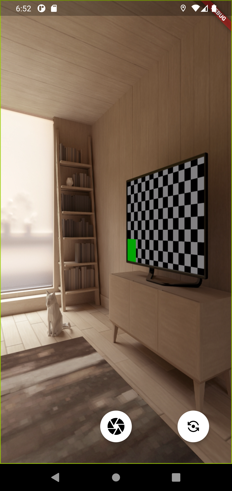
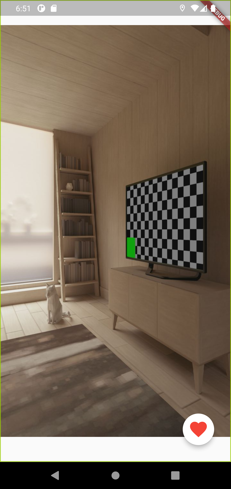

# Pikitia

Pikitia is a social mobile app developed with [Flutter](https://flutter.dev/), focused around the theme of a Pikit.

A Pikit is simply a photo, associated with the location when the photo was taken. It is meant to be ephemeral.

You can take Pikit but also see the Pikit around you, in a limited radius. That way, you can find the interesting events around you that are happening right now.

A few screenshots to demonstrate what's currently implemented:

The app is currently on a closed beta test. If you are interested to join the beta, contact me.

## Technologies used

- [Flutter](https://flutter.dev/)
- Firebase ([Firestore](https://firebase.flutter.dev/docs/firestore/overview), [Storage](https://firebase.flutter.dev/docs/storage/overview), [Authentication](https://firebase.flutter.dev/docs/auth/overview))
- [Provider](https://pub.dev/packages/provider) + [get_it](https://pub.dev/packages/get_it)

## Development

To run this application locally, you need:
- [Flutter](https://docs.flutter.dev/get-started/install)
- [To initialize Firebase](https://firebase.flutter.dev/docs/overview#initializing-flutterfire)

Once you have configured Firebase for this project, you can run `flutter pub get` to download the dependencies then `flutter run` to start the application.
